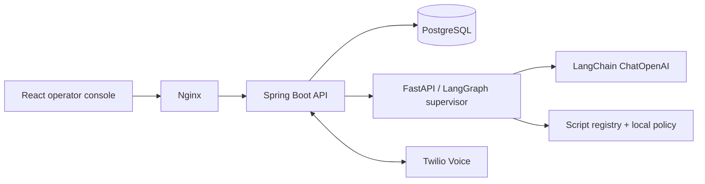

# Architecture and API

Spring Boot is the only database writer. Each mutation acquires a PostgreSQL transaction advisory lock, reads the latest session, sends an authenticated decision request to Python, then commits the resulting session and any suppression/receipt atomically. The Python working store exists only for one graph invocation; there is no SQLite database or local persistent graph checkpoint. The database is the canonical checkpoint between turns.

The LangGraph path is `START → hydrate_context → supervisor_policy → END`. Hydration reconstructs the session and persisted suppression/receipt. The supervisor applies consent, hard rules, optional LangChain analysis, evidence validation, priority routing, read-back and field confirmation. The model has no write or call-placement tools. A clear policy match can preempt the model. Known payment text is withheld before sending it to OpenAI; semantic payment matches are withheld from persisted state and handover context after classification.

`POST /api/sessions` accepts `{lead_id?, seed?}`. Lead IDs must begin `synthetic-`; omitted IDs are generated. `GET /api/sessions/{id}` restores state. `GET /api/scripts` returns the versioned script contract. `POST /api/turn` accepts `{session_id, text, event_id, revision, confidence?}`. Duplicate event IDs return current state; stale revisions are rejected. `POST /api/accept` and `/api/unavailable` accept `{session_id}`. `POST /api/dial` accepts `{session_id, number}` and requires enabled telephony plus an allowlisted destination. All API routes require the configured bearer token.

`/health` checks PostgreSQL and agent reachability. `/twilio/{start,turn,whisper,accept,unavailable,dial-result}` verify the canonical public URL and form parameters using Twilio HMAC-SHA1 signatures. Caller callbacks bind to the recorded call SID; the whisper binds the child leg for acceptance. Dial reservations commit before outbound I/O. There is no automatic retry on an uncertain provider result.

The internal Python `/decide`, `/scripts`, and `/twiml` endpoints require a separate service token. Secrets and transcripts are not included in application access logs. Model tracing is disabled by default. Browser microphone handling depends on browser permissions/support; the text path remains available.

The script registry at `agent-service/phonease/scripts.json` is the source of questions, aliases, validation and retry budgets. Increment its version after changing scripts, regenerate documentation, rebuild/restart and start a new session.
